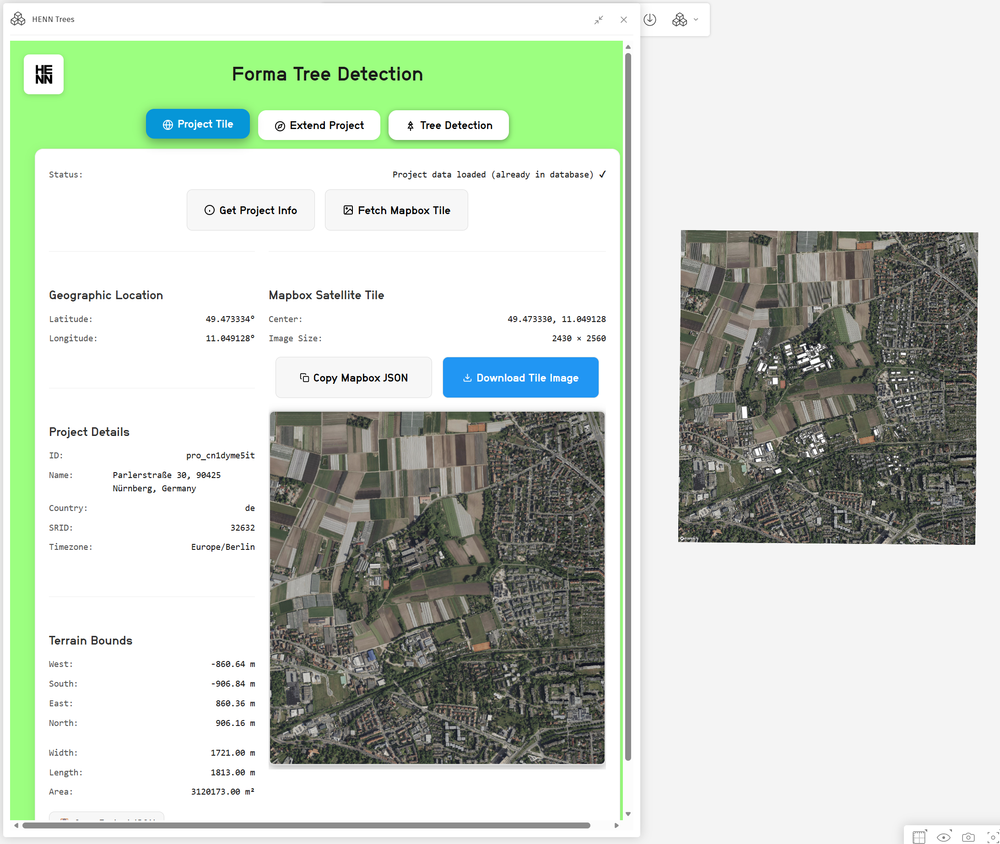
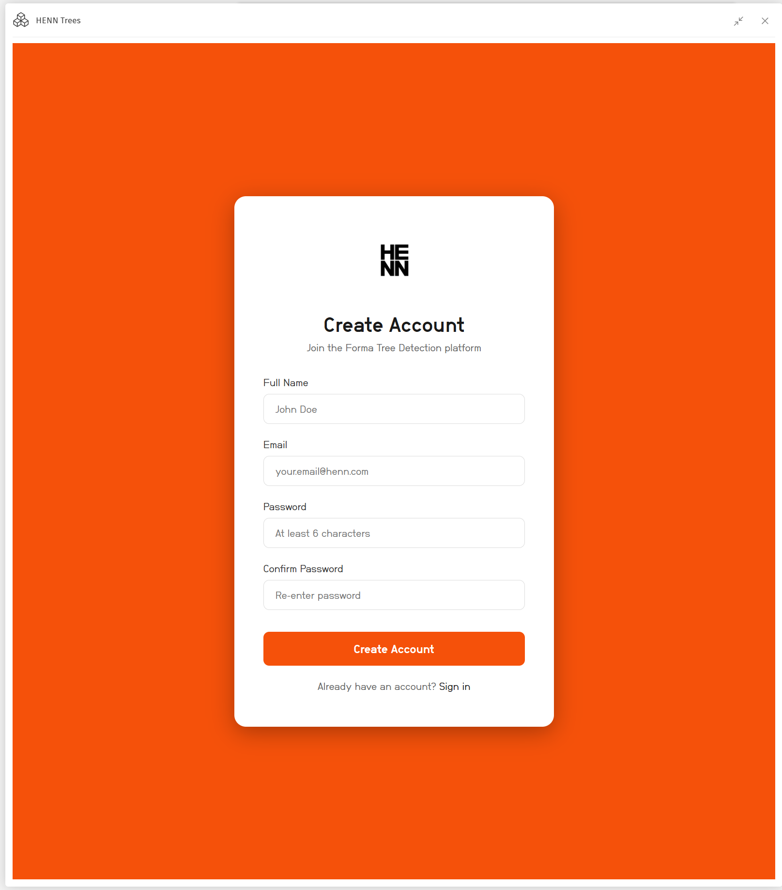
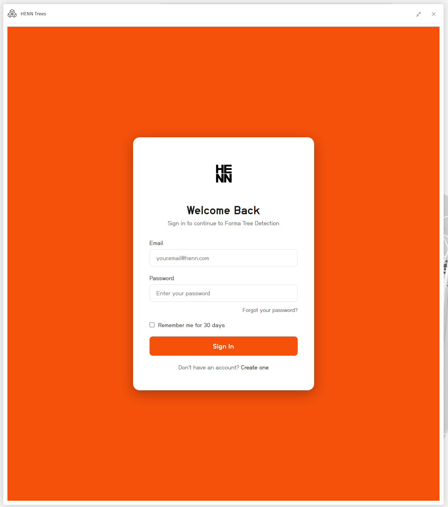
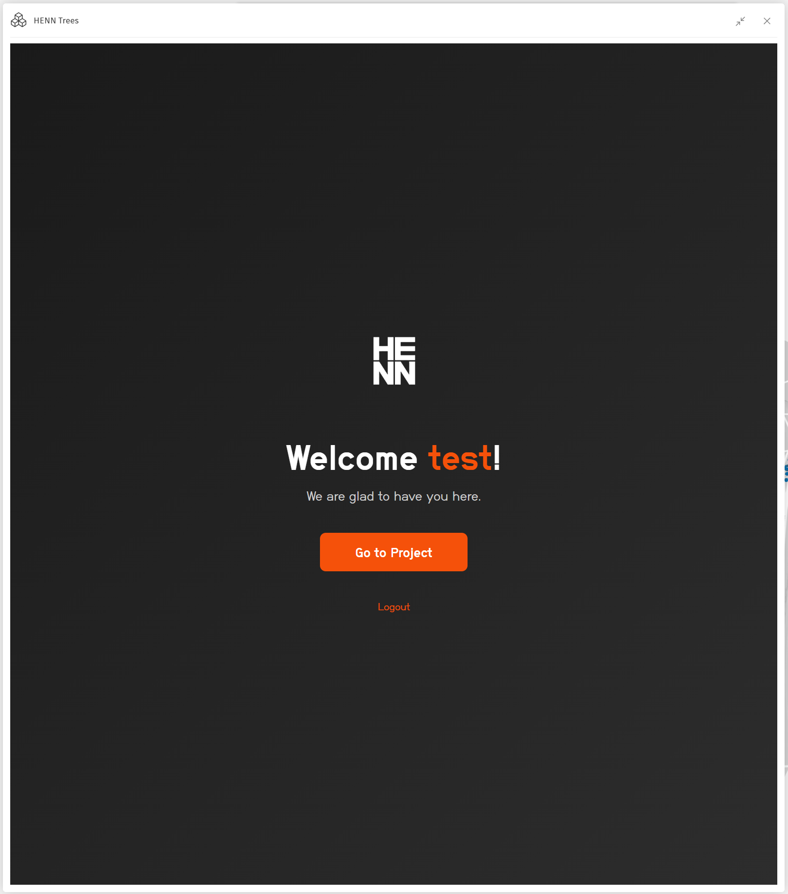
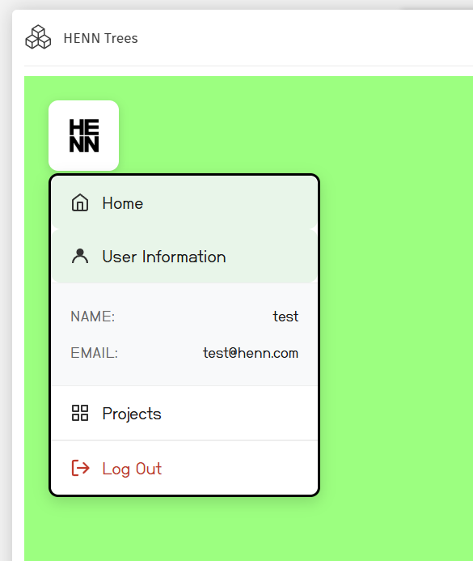
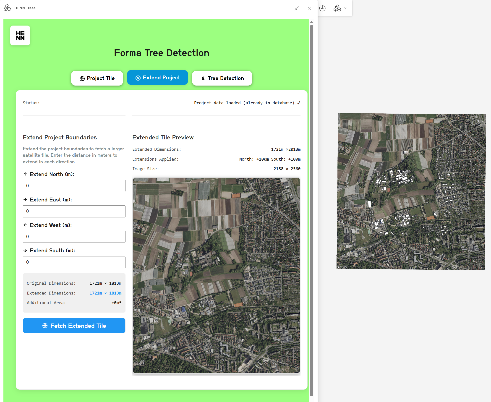
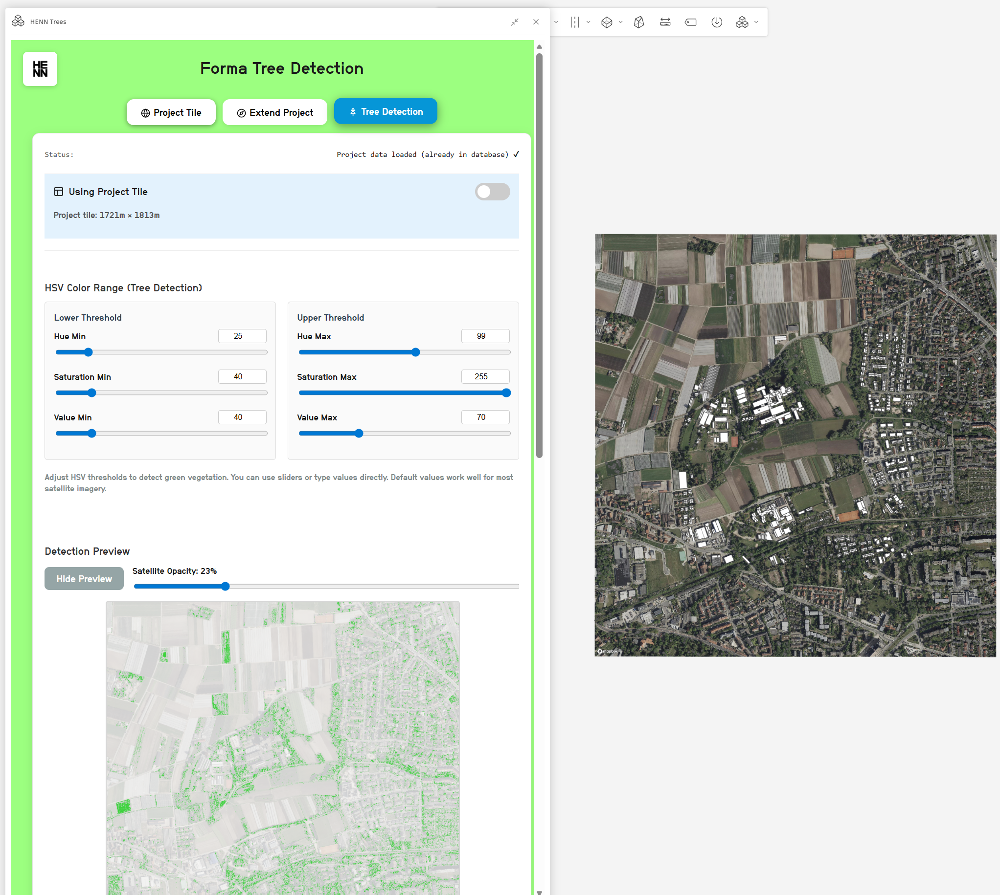
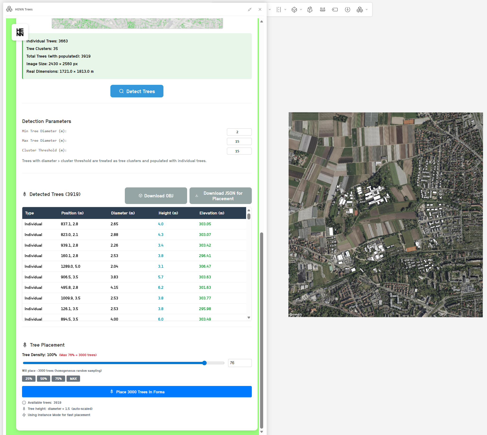

# Forma Tree Detection Extension

A React-based **Forma embedded extension** that detects trees automatically identified using OpenCV from satellite imagery and place them as 3D models directly into your Forma project.

> ⚠️ **Important:** This application is designed to run as an **embedded extension inside Autodesk Forma**. It will not work as a standalone web application. See the [Forma Embedded Views documentation](https://aps.autodesk.com/en/docs/forma/v1/embedded-views/introduction/) to learn how to create and host Forma extensions.



## 🎯 Overview

This extension automates the process of detecting and placing trees in Forma projects:

1. **Fetches satellite imagery** aligned with Forma's UTM coordinate system
2. **Detects trees** using HSV color segmentation
3. **Calculates tree dimensions** (diameter and height) from detected canopy sizes
4. **Places 3D tree models** directly into your Forma project using efficient instancing
5. **Scales trees automatically** based on detected diameter (realistic proportions)

### Key Capabilities

| Feature | Description |
|---------|-------------|
| 🌳 **Automatic Tree Detection** | Satellite imagery analysis to find trees |
| 📏 **Per-Tree Scaling** | Each tree is scaled based on its detected canopy diameter |
| ⚡ **High-Performance Placement** | 40+ trees/second using instance mode |
| 🗺️ **Extended Coverage** | Detect trees beyond Forma's ~2km terrain limit |
| 🔐 **User Authentication** | Directus-based auth with project tracking |
| 📊 **Project Management** | Track and manage your Forma projects |


## 🏗️ Architecture Overview

```
┌─────────────────────────────────────────────────────────────────────┐
│                         FORMA (Host Application)                    │
│  ┌───────────────────────────────────────────────────────────────┐  │
│  │                    Embedded Extension (iframe)                │  │
│  │  ┌─────────────────────────────────────────────────────────┐  │  │
│  │  │              React Frontend (Vite + TypeScript)         │  │  │
│  │  │   • Tree Detection UI    • Satellite Tile Viewer        │  │  │
│  │  │   • Project Management   • User Menu & Navigation       │  │  │
│  │  └─────────────────────────────────────────────────────────┘  │  │
│  └───────────────────────────────────────────────────────────────┘  │
└─────────────────────────────────────────────────────────────────────┘
                                    │
                                    ▼
┌─────────────────────────────────────────────────────────────────────┐
│                    Express Backend (Node.js)                        │
│  • Authentication (Directus integration)                            │
│  • Session management                                               │
│  • API proxy to Python backend                                      │
│  • Serves React static files in production                          │
│  Port: 3001                                                         │
└─────────────────────────────────────────────────────────────────────┘
                                    │
                                    ▼
┌─────────────────────────────────────────────────────────────────────┐
│                    Python Backend (FastAPI)                         │
│  • Tree detection (OpenCV + HSV segmentation)                       │
│  • 3D model generation (OBJ/GLB export)                             │
│  • Image processing                                                 │
│  Port: 5001                                                         │
└─────────────────────────────────────────────────────────────────────┘
                                    │
                                    ▼
┌─────────────────────────────────────────────────────────────────────┐
│                    Directus (External CMS)                          │
│  • User authentication & management                                 │
│  • Project tracking database                                        │
│  • User-project relationships                                       │
└─────────────────────────────────────────────────────────────────────┘
```

## 🛠️ Technical Stack

| Layer | Technology |
|-------|------------|
| **Frontend** | React 18 + TypeScript + Vite |
| **Forma Integration** | `forma-embedded-view-sdk/auto` |
| **Backend (API)** | Node.js + Express |
| **Backend Proxy** | Python + FastAPI + OpenCV |
| **Authentication** | Directus CMS (or local auth for testing) |
| **Coordinate Transforms** | proj4 |
| **Map Provider** | Mapbox Raster Tiles API |
| **Containerization** | Docker + Docker Compose |

## 📋 Prerequisites

- **Docker** and **Docker Compose** (recommended for easy setup)
- **Mapbox Access Token** ([Get one here](https://account.mapbox.com/))
- **Forma Account** with embedded view access
- **Directus Instance** (for authentication) OR use local auth for testing

### For Local Development (without Docker)

- Node.js 18+
- Python 3.11+
- npm or yarn

## 🔧 Installation & Setup

### Option 1: Docker (Recommended) 🐳

The easiest way to run the application is using Docker containers.

**1. Clone the repository:**
```bash
git clone https://github.com/ABCHai25/Forma-Project-Info.git
cd Forma-Project-Info
```

**2. Create environment file:**

Copy `.env.example` to `.env` and fill in your values:
```bash
cp .env.example .env
```

Edit `.env` with your credentials:
```bash
# Required
VITE_MAPBOX_TOKEN=your_mapbox_token_here
DIRECTUS_URL=https://your-directus-instance.com
DIRECTUS_STATIC_TOKEN=your_directus_token

# Optional (defaults provided)
SESSION_SECRET=your-secure-random-string
```

**3. Build and start containers:**
```bash
docker-compose up --build
```

Or run in background:
```bash
docker-compose up -d
```

**4. Access the application:**
- Backend + Frontend: http://localhost:3001
- Python API Docs: http://localhost:5001/docs

**5. Stop containers:**
```bash
docker-compose down
```

### Option 2: Local Development

**1. Clone and install dependencies:**
```bash
git clone https://github.com/ABCHai25/Forma-Project-Info.git
cd Forma-Project-Info

# Frontend dependencies
npm install

# Backend dependencies
cd backend && npm install && cd ..

# Python dependencies
cd python_backend
pip install -r requirements.txt
cd ..
```

**2. Set up environment files:**

Root `.env`:
```bash
VITE_MAPBOX_TOKEN=your_mapbox_token_here
DIRECTUS_URL=https://your-directus-instance.com
```

Backend `.env` (copy from `backend/.env.example`):
```bash
DIRECTUS_URL=https://your-directus-instance.com
DIRECTUS_STATIC_TOKEN=your_directus_token
SESSION_SECRET=your-secret-key
```

**3. Start all services:**

Terminal 1 - Python Backend:
```bash
cd python_backend
python main.py
```

Terminal 2 - Express Backend:
```bash
cd backend
npm start
```

Terminal 3 - React Frontend:
```bash
npm run dev
```

## 🔐 Authentication System

This extension uses **Directus** as the authentication and project management backend. Users must log in before accessing the tree detection features.

### Authentication Flow


*New users can register with email and password*


*Existing users log in with their credentials*


*After login, users see a welcome page before entering the app*

### User Menu & Navigation

Once logged in, users have access to a dropdown menu:



The menu provides:
- **🏠 Home** - Return to the main tree detection interface
- **👤 User Information** - View your account details
- **📁 My Projects** - View all Forma projects you've worked on
- **🚪 Logout** - Sign out of the application

### Project Tracking

The extension automatically logs Forma projects to Directus when you click "Get Project Info". This creates a history of all projects you've worked on, including:
- Project ID and name
- Geographic location (coordinates)
- Terrain dimensions
- SRID and timezone
- Last accessed date

### Alternative: Local Authentication (For Testing)

If you don't have a Directus instance, you can use the local authentication template:

👉 **[Henn Auth Template](https://github.com/ABCHai25/Henn_Auth_Template)**

This provides a simple local auth system for development and testing purposes.

## 📖 Usage Guide

### Step 1: Authentication

1. Navigate to `http://localhost:3001` (or your deployed URL)
2. **New users:** Click "Register" and create an account
3. **Existing users:** Enter your email and password to log in
4. Click "Enter Application" on the welcome page

### Step 2: Get Project Information


1. Click **"Get Project Info"** to retrieve Forma project metadata and terrain boundaries
2. Click **"Fetch Mapbox Tile"** to fetch satellite imagery

The extension automatically:
- Calculates optimal zoom level for your project size
- Fetches high-resolution raster tiles
- Applies perspective correction for UTM alignment
- Logs the project to your Directus account

### Step 3: Extend Coverage (Optional)



Forma limits terrain to ~2km × 2km. To detect trees beyond this limit:

1. Go to the **"Extend Project"** tab
2. Enter extension distances in meters (North, East, South, West)
3. Click **"Fetch Extended Tile"**

### Step 4: Detect Trees



1. Go to the **"Tree Detection"** tab
2. Select your tile source (Project Tile or Extended Tile)
3. Adjust HSV thresholds if needed for your imagery
4. Click **"Detect Trees"**



Results show:
- Number of trees detected
- Individual tree coordinates
- Estimated diameters and heights
- Elevation of each tree

### Step 5: Place Trees in Forma

1. Review detected trees in the list
2. Adjust the **Tree Model Scale** if needed
3. Click **"Place Trees"**

Trees are placed using **instance mode** for maximum performance:
- Single 3D model definition uploaded once
- Thousands of instances placed at 40+ trees/second
- Each tree scaled according to its detected diameter

### Step 6: Export Options

- **📦 Download OBJ** - 3D model with trees on textured ground (for Rhino, Blender)
- **📥 Download JSON** - Raw detection data with coordinates

## 🧮 How It Works

### Satellite Imagery Pipeline

1. **Coordinate Transformation**: Convert Forma's UTM terrain bounds to WGS84 (lat/lon) using proj4
2. **Zoom Calculation**: Determine optimal tile resolution (~0.6-0.8 m/pixel at zoom 18)
3. **Tile Fetching**: Download grid of 512×512px Mapbox raster tiles
4. **Stitching & Cropping**: Combine tiles and crop to exact boundaries
5. **Perspective Warping**: Apply homography to correct Web Mercator → UTM distortions

### Tree Detection Algorithm

The Python backend uses **HSV color segmentation**:
1. Convert satellite image to HSV color space
2. Apply threshold masks to isolate green vegetation
3. Find contours of tree canopies
4. Calculate centroid and diameter for each tree
5. Return coordinates in both pixels and meters

### Tree Placement (Instance Mode)

Instead of creating thousands of separate 3D models (slow and bloated), we use **true instancing**:

```
Traditional: 1,000 trees = 1,000 element definitions ❌ (slow)
Instance Mode: 1,000 trees = 1 definition + 1,000 instances ✅ (fast)
```

**Performance:** 40+ trees/second placement speed

### Per-Tree Scaling

Each tree is scaled based on its detected canopy diameter:
- **Diameter** = measured from satellite imagery (meters)
- **Height** = diameter × 1.5 (realistic proportion)
- **Scale factor** = calculated to match the base tree model

This creates natural variation in tree sizes across your project.

### Extended Tile Feature

The "Extend Project" feature allows coverage beyond Forma's terrain limits:
1. User specifies extension distances (meters) in each direction
2. New bounding box is calculated (original + extensions)
3. Larger satellite tile is fetched and processed
4. Trees can be detected across the entire extended area and exported as OBJ

## 📁 Project Structure

```
my-react-forma/
├── src/
│   ├── App.tsx                        # Main application with navigation
│   ├── components/
│   │   ├── ActionButtons.tsx          # Project info & fetch buttons
│   │   ├── ExtendProjectPanel.tsx     # Extended tile controls
│   │   ├── MapboxTilePanel.tsx        # Satellite tile display
│   │   ├── TreeListPanel.tsx          # Detection results & placement
│   │   ├── TreePlacementTester.tsx    # Instance mode placement
│   │   ├── UserMenu.tsx               # Navigation dropdown
│   │   └── MyProjectsPage.tsx         # Project history page
│   ├── hooks/
│   │   ├── useFormaProject.ts         # Project metadata management
│   │   ├── useMapboxTile.ts           # Tile fetching & warping
│   │   └── useTreePipeline.ts         # Detection pipeline
│   ├── services/
│   │   ├── directus.service.ts        # Directus API client
│   │   └── ...
│   └── main.tsx                       # Entry point
├── backend/
│   ├── index.js                       # Express server
│   ├── auth-setup.js                  # Authentication configuration
│   ├── passport-config.js             # Passport.js setup
│   ├── routes/                        # API routes
│   │   └── auth.js                    # Auth endpoints
│   ├── services/
│   │   ├── directus.js                # Directus integration
│   │   └── email.js                   # Email service (password reset)
│   └── middleware/                    # Express middleware
├── python_backend/
│   ├── main.py                        # FastAPI server
│   ├── Dockerfile                     # Python container
│   ├── tree_detector_core.py          # Detection algorithm
│   └── model_generator_core.py        # OBJ/GLB generation
├── public/
│   ├── login.html                     # Login page
│   ├── register.html                  # Registration page
│   ├── welcome.html                   # Welcome page
│   └── forgot-password.html           # Password reset (Placeholder for now)
├── Dockerfile                         # Backend + Frontend container
├── docker-compose.yml                 # Container orchestration
├── .env.example                       # Environment template
└── README.md
```

## 🔑 Environment Variables

### Root `.env`
```bash
# Required
VITE_MAPBOX_TOKEN=pk.xxx              # Mapbox API token
DIRECTUS_URL=https://your-instance    # Directus URL
DIRECTUS_STATIC_TOKEN=xxx             # Directus API token

# Optional
VITE_API_BASE_URL=http://localhost:3001
SESSION_SECRET=your-secure-secret
```

### Backend `.env`
```bash
DIRECTUS_URL=https://your-instance
DIRECTUS_STATIC_TOKEN=xxx
SESSION_SECRET=your-secure-secret
PYTHON_API_URL=http://localhost:5001
```

## 🐳 Docker Commands

```bash
# Build and start all services
docker-compose up --build

# Start in background
docker-compose up -d

# View logs
docker-compose logs -f

# View specific service logs
docker-compose logs -f backend
docker-compose logs -f python-api

# Stop all services
docker-compose down

# Rebuild specific service
docker-compose build backend
docker-compose build python-api
```

## 📊 Performance

| Operation | Time |
|-----------|------|
| Tile fetching (2km bbox) | 2-20 seconds |
| Tree detection (standard) | 2-5 seconds |
| Tree detection (5km extended) | 60-120 seconds |
| Tree placement | 40+ trees/second |

### Limits

- **Maximum recommended extended tile:** 5km × 5km
- **Maximum trees per placement:** ~60,000 (larger creates unstable files)
- **Detection timeout:** 10 minutes
- **Model generation timeout:** 5 minutes

## 🐛 Troubleshooting

| Issue | Solution |
|-------|----------|
| CORS errors on tile fetch | Check Mapbox token is set in `.env` |
| "DIRECTUS_URL missing" | Add `DIRECTUS_URL` to your `.env` file |
| Container unhealthy | Run `docker-compose logs` to check errors |
| Trees not detected | Adjust HSV thresholds for your imagery |
| Slow tree placement | Normal for large projects (rate limiting) |

## 📚 Additional Resources

- **Forma Embedded Views:** https://aps.autodesk.com/en/docs/forma/v1/embedded-views/introduction/
- **Mapbox Raster Tiles:** https://docs.mapbox.com/api/maps/raster-tiles/
- **proj4 Documentation:** http://proj4.org/

## 🤝 Contributing

Contributions welcome! To contribute:

1. Fork the repository
2. Create feature branch (`git checkout -b feature/AmazingFeature`)
3. Commit changes (`git commit -m 'Add AmazingFeature'`)
4. Push to branch (`git push origin feature/AmazingFeature`)
5. Open Pull Request

### Areas for Improvement

- [ ] GPU-accelerated warping (WebGL)
- [ ] Batch processing multiple projects
- [ ] Additional tree model variations
- [ ] Integration with other Forma elements

## 📄 License

MIT License - see LICENSE file for details

---

*Last Updated: December 2025*
