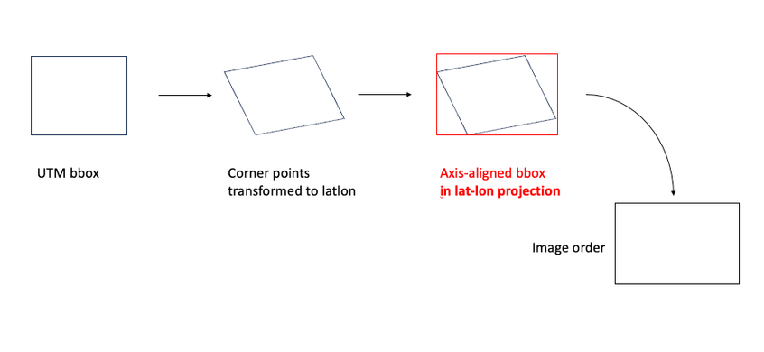
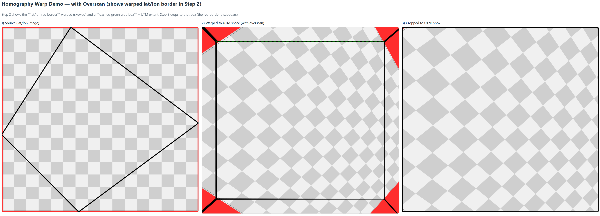

# Forma Tile Extraction Extension

A React-based Forma extension that fetches high-resolution Mapbox satellite imagery aligned with Forma's UTM coordinate system through advanced coordinate transformation and perspective warping.


## 🎯 Overview

This extension solves a critical challenge in geospatial data integration: **obtaining satellite imagery that precisely aligns with Forma's UTM projection**. Unlike simple map overlays, this tool:

1. **Fetches raster tiles** at optimal zoom levels for maximum resolution
2. **Stitches tiles** into a single canvas covering the project area
3. **Transforms coordinates** from UTM to WGS84 (lat/lon)
4. **Applies perspective warping** to correct for projection differences
5. **Outputs UTM-aligned imagery** matching Forma's coordinate system

### Why This Matters

Forma uses **UTM (Universal Transverse Mercator)** projection, which represents positions as metric coordinates (meters east/north from a reference point). Mapbox and most web mapping services use **Web Mercator (EPSG:3857)** projection. Simply overlaying images from these different projections results in:
- Rotated/skewed imagery
- Misaligned features
- Distorted geometry

This extension uses **homography transformations** to correct these distortions, ensuring pixel-perfect alignment.

## 🚀 Key Features

### Core Functionality
- 📊 **Dynamic Zoom Calculation**: Automatically determines optimal tile resolution based on project size
- 🗺️ **Raster Tile Stitching**: Fetches and combines multiple high-resolution tiles (512×512px @2x)
- 🔄 **Perspective Warping**: Uses Direct Linear Transform (DLT) to correct projection differences
- 📍 **Precise Coordinate Transformation**: proj4 library for accurate UTM ↔ WGS84 conversion
- 💾 **Backend Storage**: Express API for saving processed tiles
- 🏷️ **Project Metadata**: Display location, dimensions, SRID, and coordinate reference systems

### Extended Coverage (Beyond Forma Limits)
- 🧭 **Extended Tile Fetching**: Surpass Forma's ~2km × 2km terrain limit by extending boundaries in any direction
- 🎯 **Custom Extensions**: Choose how many meters to extend North, East, West, or South
- 🔀 **Tile Selector**: Toggle between project tile and extended tile for tree detection
- 🌍 **Large-Scale Detection**: Detect trees across areas larger than Forma's default terrain bounds

### Tree Detection & 3D Export
- 🌳 **AI-Powered Tree Detection**: Python FastAPI backend with OpenCV-based HSV color segmentation
- 📦 **3D Model Export**: Download detected trees as OBJ files for Rhino, Blender, or other 3D software
- 📥 **JSON Export**: Download complete detection results with pixel and meter coordinates
- 🎨 **Interactive Preview**: Real-time HSV parameter tuning with live detection preview
- 📏 **Accurate Positioning**: Trees positioned on textured ground plane matching satellite imagery
- 🌲 **Realistic Scaling**: Tree heights calculated from detected diameters (height = diameter × 1.5)

### 🎉 High-Performance Tree Placement (Instance Mode)
**Successfully implemented!** We achieved highly efficient tree placement directly into Forma projects using "True Instancing":
- ⚡ **40+ trees per second** placement speed (vs. ~3-5 trees/sec with old approach)
- 🎯 **Single Definition, Multiple Instances**: Creates one element definition, then places thousands of instances
- 📦 **Minimal Project Bloat**: Keeps Forma projects small and responsive
- 🤖 **Fully Automated**: Auto-uploads GLB model, creates definition, and places instances concurrently
- 📚 **Documented**: See `Documentation/INSTANCE_MODE_IMPLEMENTATION.md` for implementation guide


### Technical Highlights
- ✅ Sub-meter accuracy (~0.75 m/pixel at zoom 18)
- ✅ Handles terrain bounds as offsets from reference points
- ✅ Supports any UTM zone via proj4 projection strings
- ✅ Eliminates padding artifacts from axis-aligned bboxes
- ✅ Pixel-perfect homography with nearest-neighbor sampling
- ✅ Client-side OBJ generation for instant local downloads

## 📸 Visual Demonstrations

### Quality Comparison: Static API vs Raster Tiles

*Left: Stitched raster tiles (zoom 17) | Right: Mapbox Static API*

The raster tile approach provides sharper imagery because:
- **Fixed zoom level** ensures consistent resolution, which is crucial for detecting trees accurately later on
- **No auto-zoom calculation** that reduces quality
- **Precise cropping** eliminates padding and rotation artifacts

### Coordinate Transformation Process

*Visualization of coordinate transformation from UTM to WGS84 lat/lon*
*(Credit: [Forma Developer Forum](https://forums.autodesk.com/t5/forma-developer-forum/terrain-bbox-differs-from-mapbox-image/m-p/12688873))*

### Perspective Warping Demo

*Demonstrating the homography transform that corrects Web Mercator → UTM distortions*

## 🏗️ Architecture

### **Old Approach (Static API)** ❌
```
UTM Bbox → WGS84 Bbox → Static API (auto-zoom) → Padded Image → Warp
```
**Problems:**
- Mapbox auto-calculates zoom (often too low)
- Axis-aligned bbox creates padding
- Complex corner pixel calculations
- Lower effective resolution

### **New Approach (Raster Tiles)** ✅
```
UTM Bbox → WGS84 Bbox → Calculate Optimal Zoom → Fetch Raster Tiles → Stitch → Crop → Warp
```
**Benefits:**
- Fixed zoom based on desired resolution
- Precise cropping to exact bbox
- Higher quality tiles (@2x = 512×512px)
- Simplified corner calculation

### Zoom Calculation Formula
```typescript
zoom = log2((earthCircumference/256) / desiredMPP / cos(lat))
```
Where:
- `desiredMPP` = meters per pixel (calculated from bbox size / output pixels)
- `earthCircumference/256` = meters per pixel at zoom 0
- `cos(lat)` = correction for latitude distortion in Web Mercator

**Example:** For a ~2km bbox at mid-latitudes with 2560×2408px output:
- Desired: ~0.8 m/px
- Calculated zoom: ~18
- Actual resolution: ~0.6 m/px (sub-meter accuracy)

## 🛠️ Technical Stack

- **Frontend:** React 18 + TypeScript + Vite
- **Forma SDK:** `forma-embedded-view-sdk/auto`
- **Coordinate Transforms:** proj4 2.19.10
- **Map Provider:** Mapbox Raster Tiles API (v4) + Static Images API
- **Image Processing:** Canvas 2D API (homography, stitching, warping)
- **Backend (Tile Storage & Proxy):** Node.js + Express (handles CORS and proxies requests to Python backend)
- **Backend (Tree Detection):** Python + FastAPI + OpenCV + NumPy

## 📋 Prerequisites

- Node.js (version 14 or higher)
- Python 3.8+ (for tree detection)
- npm or yarn
- Forma account with embedded view access
- **Mapbox Access Token** ([Get one here](https://account.mapbox.com/))

## 🔧 Installation

1. **Clone the repository:**
```bash
git clone https://github.com/ABCHai25/Forma-Project-Info.git
cd Forma-Project-Info
```

2. **Install dependencies:**
```bash
npm install
```

3. **Set up environment variables:**
Create a `.env` file in the project root:
```bash
VITE_MAPBOX_TOKEN=your_mapbox_token_here
VITE_API_BASE_URL=http://localhost:3001  # Optional, defaults to localhost:3001
```

4. **Start the Node.js backend (tile storage):**
```bash
cd backend
npm install
npm start
```

5. **Start the Python backend (tree detection):**
```bash
cd python_backend
pip install -r requirements.txt
python main.py
```

6. **Start the development server:**
```bash
npm run dev
```

## 📖 Usage Guide

### Initial View

When you first open the extension, you'll see the main interface with three tabs:


### Tab 1: Project Tile (Standard Workflow)


1. **Get Project Info** → Retrieves metadata (location, SRID, projection string, reference point)
2. **Get Terrain BBox** → Fetches terrain bounds (offsets from reference point)
3. **Fetch Mapbox Tile** → Automatically:
   - Calculates optimal zoom level
   - Fetches raster tiles at that zoom
   - Stitches tiles into single canvas
   - Crops precisely to bbox
   - Applies perspective warp to UTM projection
   - Displays aligned imagery

### Tab 2: Extend Project (Beyond Forma Limits)


**Use Case:** Forma limits terrain to approximately 2km × 2km. This tab allows you to extend coverage beyond those boundaries.

1. **Enter extensions** in meters for each direction:
   - **North:** Extend northward (e.g., 500m)
   - **East:** Extend eastward (e.g., 300m)
   - **West:** Extend westward (e.g., 200m)
   - **South:** Extend southward (e.g., 400m)

2. **Fetch Extended Tile** → Creates larger satellite imagery covering the extended area

3. **View extended coverage** → Preview shows total dimensions (e.g., 3km × 2.5km)

### Tab 3: Tree Detection


1. **Select tile source:**
   - **Project Tile** (default): Detect trees within Forma's terrain bounds
   - **Extended Tile** (toggle on): Detect trees in the larger extended area

2. **Adjust HSV thresholds** → Fine-tune color detection parameters for accurate tree identification

3. **Detect Trees** → AI analyzes the selected tile and identifies tree locations


4. **Download results:**
   - **📦 Download OBJ**: Get 3D model with trees on textured ground plane (for Rhino, Blender, etc.)
   - **📥 Download JSON**: Get detection data with coordinates and tree parameters

### Importing OBJ into Forma

After downloading the OBJ file, you can manually import it into your Forma project:


1. In Forma, navigate to the **Import** section
2. Select **3D Model** import option
3. Choose your downloaded OBJ file
4. The trees will appear in your Forma project with correct positioning and scale

## 📁 Project Structure

```
my-react-forma/
├── src/
│   ├── App.tsx                     # Main application (3-tab UI with extended tiles)
│   ├── components/                 # Modular UI components
│   │   ├── ActionButtons.tsx       # Project info and tile fetch buttons
│   │   ├── ExtendProjectPanel.tsx  # Extended tile controls
│   │   ├── TreeListPanel.tsx       # Detected trees table with downloads
│   │   └── ...
│   ├── hooks/                      # Custom React hooks
│   │   ├── useFormaProject.ts      # Project metadata management
│   │   ├── useMapboxTile.ts        # Tile fetching and warping
│   │   ├── useTreePipeline.ts      # Tree detection pipeline
│   │   └── ...
│   ├── services/                   # API and processing services
│   ├── utils/                      # Coordinate transforms and calculations
│   ├── types/                      # TypeScript type definitions
│   └── main.tsx                    # Application entry point
├── backend/
│   ├── index.js                    # Express server (tile storage + proxy to Python backend)
│   └── package.json
├── python_backend/
│   ├── main.py                     # FastAPI server (tree detection)
│   ├── tree_detector_core.py       # HSV-based detection algorithm
│   ├── model_generator_core.py     # OBJ file generation
│   └── requirements.txt
├── fetched_tiles/                  # Saved satellite tiles
├── public/                         # Static assets and screenshots
└── README.md
```

### Legacy Files (Reference Only)

Early development versions showing the evolution of the solution:

- **`App_fullFrontend.tsx`**: Initial monolithic version with all logic in one file (before modular refactor)
- **`App_bboxMap&zoom.tsx`**: Static API approach with manual zoom controls
- **`App_wihoutHD.tsx`**: Static API without @2x resolution
- **`App_without_Zoom.tsx`**: Baseline Static API implementation

**Note:** Current `App.tsx` uses a modular architecture with custom hooks and components for better maintainability.

### Demo Files

- **`WMTS.tsx`**: Side-by-side comparison of raster tiles vs Static API
- **`WarpDemo.tsx`**: Interactive homography transformation visualization

To run demos, change the import in `main.tsx`:
```typescript
// import App from './App.tsx'           // Main app
// import App from './App-WMTS.tsx'      // Quality comparison demo
// import App from './App-WarpDemo.tsx'  // Warping demo
```

## 🧮 How It Works

### Pipeline Overview

The extension performs a multi-step transformation pipeline:

1. **Coordinate Transformation**: Convert UTM terrain bounds (offsets from reference point) to WGS84 lat/lon using proj4
2. **Zoom Calculation**: Determine optimal tile zoom level based on desired resolution (meters per pixel)
3. **Tile Fetching**: Fetch grid of high-resolution raster tiles covering the WGS84 bbox
4. **Stitching & Cropping**: Combine tiles and crop precisely to bbox boundaries
5. **Perspective Warping**: Apply homography transformation to correct Web Mercator → UTM distortions
6. **Tree Detection**: Python backend analyzes imagery using HSV color segmentation
7. **3D Generation**: Creates OBJ file with positioned trees on textured ground plane

### Backend Architecture

**Express Server (Node.js)** acts as both:
- **Tile Storage**: Saves processed satellite imagery
- **Proxy Server**: Handles CORS and forwards tree detection requests from frontend to Python backend

**Python Server (FastAPI)** handles:
- Tree detection using OpenCV
- OBJ file generation with tree models

**Key Insight:** UTM corners form a rotated quadrilateral within the Mercator image. The homography matrix maps this quadrilateral back to an axis-aligned rectangle in UTM projection, ensuring perfect alignment with Forma's coordinate system.

### 📍 Understanding Tree Detection Coordinates

When tree detection is performed (Phase 3), each tree receives coordinates in **two different systems**:

#### **Pixel Coordinates** (`centroidPx`, `positionPx`)
- **Origin:** Top-left corner of the image (0, 0)
- **X-axis:** Increases to the right (pixels)
- **Y-axis:** Increases downward (standard image coordinates)
- **Units:** Pixels
- **Example:** `[1280, 640]` = 1280px from left, 640px from top of image

#### **Meter Coordinates** (`centroidM`, `positionM`)
- **Origin:** Top-left corner of the **terrain bbox** used for detection
- **X-axis:** Meters east from bbox minimum corner
- **Y-axis:** Meters south from bbox minimum corner  
- **Units:** Meters
- **Example:** `[500.5, 300.2]` = 500.5m east and 300.2m south from bbox corner

**Important:** These meter coordinates are **relative to the terrain bbox**, NOT absolute UTM coordinates.

#### **Converting to Absolute UTM Coordinates**

To get absolute UTM coordinates (required for placing trees in Forma's world space):

```typescript
// Tree detection returns relative coordinates
const treeCentroidM = [500.5, 300.2]; // meters from bbox corner

// Terrain bbox (offsets from refPoint)
const terrainBbox = {
  min: { x: -979, y: -920, z: 0 },  // offsets from refPoint (meters)
  max: { x: 978, y: 920, z: 0 }
};

// Forma project refPoint (absolute UTM)
const refPoint = [355850.23, 5671234.56]; // [easting, northing]

// Step 1: Add bbox minimum to get offset from refPoint
const offsetFromRefPoint = [
  terrainBbox.min.x + treeCentroidM[0],  // -979 + 500.5 = -478.5
  terrainBbox.min.y + treeCentroidM[1]   // -920 + 300.2 = -619.8
];

// Step 2: Add refPoint to get absolute UTM
const absoluteUTM = [
  refPoint[0] + offsetFromRefPoint[0],  // 355850.23 + (-478.5) = 355371.73 (easting)
  refPoint[1] + offsetFromRefPoint[1]   // 5671234.56 + (-619.8) = 5670614.76 (northing)
];

console.log(`Absolute UTM: ${absoluteUTM[0]}E, ${absoluteUTM[1]}N`);
```

**Conversion Formula:**
```
Absolute UTM = refPoint + terrainBbox.min + tree.centroidM
```

This conversion is essential for:
- Placing 3D tree models in Forma at correct world positions
- Exporting tree locations to GIS software
- Integrating with other geospatial datasets
- Validating tree positions against site plans

**Coordinate System Summary:**
```
Image Pixels (0,0 at top-left)
    ↓ × meters_per_pixel
Relative Meters (0,0 at bbox corner)
    ↓ + terrainBbox.min
Offsets from refPoint
    ↓ + refPoint
Absolute UTM Coordinates
```

## 🔑 Key Algorithms

### Direct Linear Transform (DLT)
Solves for homography matrix from 4 point correspondences:
```
For each corner pair (x,y) → (x',y'):
  [-x  -y  -1   0   0   0  x·x'  y·x'  x'] [h0]   [0]
  [ 0   0   0  -x  -y  -1  x·y'  y·y'  y'] [h1] = [0]
                                            [h2]
                                            [h3]
                                            [h4]
                                            [h5]
                                            [h6]
                                            [h7]
                                            [1]
```
Solve using Gaussian elimination + least squares.

### Tile Coordinate Conversion
```typescript
// Longitude → Tile X
x = floor(((lon + 180) / 360) × 2^zoom)

// Latitude → Tile Y (Web Mercator projection)
y = floor((1 - ln(tan(lat) + sec(lat)) / π) / 2 × 2^zoom)
```

## 🌐 API Reference

### Mapbox APIs Used

**Raster Tiles API (Current):**
```
GET https://api.mapbox.com/v4/mapbox.satellite/{z}/{x}/{y}@2x.png?access_token={token}
```
- Returns 512×512px tiles (with @2x)
- Fixed zoom level for consistent quality
- Stitched to cover bbox

**Static Images API (Legacy):**
```
GET https://api.mapbox.com/styles/v1/mapbox/satellite-v9/static/[{bbox}]/{width}x{height}@2x?access_token={token}
```
- Auto-calculates zoom (less control)
- Returns single image with padding
- Used in legacy App versions

### Backend API

**Save Tile:**
```http
POST /api/saveTile
Content-Type: application/json

{
  "imageUrl": "data:image/png;base64,...",
  "projectId": "pro_t6b6iu8gr8",
  "zoom": 18,
  "bbox": { "west": -979, "south": -920, "east": 978, "north": 920 },
  "center": { "latitude": 51.171957, "longitude": 6.843056 }
}
```

**Response:**
```json
{
  "message": "Tile saved successfully",
  "filename": "satellite_tile_pro_t6b6iu8gr8_zoom18_2025-10-29T10-35-32.png",
  "path": "/fetched_tiles/satellite_tile_..."
}
```

## 🔒 Security

- ✅ **Environment variables** for sensitive tokens (`.env` excluded from Git)
- ✅ **CORS enabled** on backend for frontend communication
- ✅ **50MB body limit** to handle large base64 images
- ✅ **Token sanitization** in console logs (configured, can be removed before push)
- ✅ **`.github` folder ignored** (contains Copilot instructions with API usage patterns)

**Before pushing to public repo:**
```bash
# Remove token from console logs
# Search for: MAPBOX_ACCESS_TOKEN
```

## 📊 Performance

**Typical Performance (2km bbox, zoom 18):**
- Tile fetching: ~2-20 seconds (depends on tile count and network)
- Stitching: <100ms
- Cropping: <50ms
- Warping: ~3-5 seconds (5-6M pixels transformed)
- Tree detection: ~2-5 seconds for small areas, 60-120 seconds for large extended tiles (5km × 5km recomended limit)
- Total workflow: ~10-30 seconds (standard), up to 2-3 minutes (extended large tiles)

**Optimizations:**
- Nearest-neighbor sampling (faster than bilinear)
- Canvas-based operations (hardware accelerated)
- Efficient homography calculation
- @2x tiles maximize quality without excessive resolution
- 10-minute timeout for tree detection (handles very large tiles)
- 5-minute timeout for 3D model generation

### Tree Detection Performance & Limits

**Detection Timeouts:**
- **Frontend → Express:** 10 minutes (600 seconds)
- **Express → Python:** 10 minutes (600 seconds)
- **Model Generation:** 5 minutes (300 seconds)

These extended timeouts support processing very large tiles (up to 5km × 5km) with tens of thousands of trees.

**3D Model Size Limits:**

For optimal performance and compatibility with 3D software (Rhino, Blender, etc.):

| Tree Count | OBJ File Size | 3DM File Size | Status | Load Time |
|------------|---------------|---------------|--------|-----------|
| < 10,000 | < 100MB | < 50MB | ✅ Recommended | < 30 sec |
| 10,000 - 20,000 | 100-200MB | 50-100MB | ✅ Good | 30-60 sec |
| 20,000 - 40,000 | 200-400MB | 100-200MB | ⚠️ Large | 1-3 min |
| 40,000 - 60,000 | 400-600MB | 200-300MB | ⚠️ Very Large | 3-5 min |
| > 60,000 | > 600MB | > 300MB | ❌ Too Large | Likely to crash |

**Hard Limit:** Models with **> 60,000 trees** are automatically rejected to prevent:
- Browser crashes during download
- 3D software crashes during import
- Excessive file sizes (>600MB)

**If you hit the 60k limit:**
- Increase "Cluster Threshold" from 15m → 25-30m (merges nearby trees)
- Reduce extended tile area (smaller coverage)
- Process area in multiple smaller sections

**Large Model Behavior:**
- Models with **20,000+ trees** are saved directly to your **Downloads folder** (not downloaded via browser)
- User receives popup notification with filename, tree count, and file size
- Prevents browser memory issues with large files


## 🐛 Troubleshooting

**Issue:** Warped image appears blank or distorted
- **Check:** Console for "Valid pixels sampled" percentage
- **Solution:** Ensure corners form a valid quadrilateral (not degenerate)

**Issue:** Low-quality output despite high zoom
- **Check:** Zoom level in console logs
- **Solution:** Verify desiredMPP calculation and cos(lat) correction

**Issue:** Misalignment with Forma
- **Check:** Reference point and projection string
- **Solution:** Ensure proj4 string matches Forma's SRID exactly

**Issue:** Tree detection not finding trees
- **Check:** HSV threshold values in UI
- **Solution:** Adjust Hue, Saturation, and Value ranges to match vegetation color in your satellite imagery

**Issue:** Python backend not starting
- **Check:** Python dependencies installed (`pip install -r requirements.txt`)
- **Solution:** Ensure Python 3.8+ and all required packages are available

## 📚 Additional Resources

- **Forma Embedded Views:** https://aps.autodesk.com/en/docs/forma/v1/embedded-views/
- **Mapbox Raster Tiles:** https://docs.mapbox.com/api/maps/raster-tiles/
- **proj4 Documentation:** http://proj4.org/
- **UTM Projection:** https://en.wikipedia.org/wiki/Universal_Transverse_Mercator_coordinate_system
- **Homography Tutorial:** https://docs.opencv.org/4.x/d9/dab/tutorial_homography.html
- **forma_Kasper_example.js:** Reference code from Forma developer explaining projection handling

## 🤝 Contributing

Contributions welcome! Areas for improvement:
- [ ] Web Workers for parallel tile fetching
- [ ] GPU-accelerated warping (WebGL)
- [ ] IndexedDB caching for tiles
- [ ] Dynamic quality adjustment
- [ ] Batch processing multiple projects
- [ ] Alignment validation metrics (SSIM, RMSE)

**To contribute:**
1. Fork the repository
2. Create feature branch (`git checkout -b feature/AmazingFeature`)
3. Commit changes (`git commit -m 'Add AmazingFeature'`)
4. Push to branch (`git push origin feature/AmazingFeature`)
5. Open Pull Request

## 📄 License

MIT License - see LICENSE file for details

---


*Last Updated: November 06, 2025*